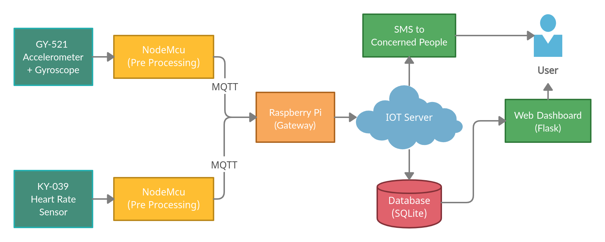

# Fall Detection and Health Monitoring System (IoT)

Developing an IoT based fall detection system and which also sends an emergency SMS alert.  The device should alsorecord pulse rate which can be stored and monitored through a web dashboard and trigger an alert on abnormal patterndetection.

# System Architecture

## Client-side

We have used two sensors, GY521 (MPU6050) accelerator plus gyroscope and KY039 heart rate sensor.  The data fromthe  sensors  are  collected  via  two  separate  esp8266  (NodeMcus).   The  NodeMcu(s)  then  uses  the  MQTT  protocol  forcommunication  with  the  raspberry  pi  (Gateway)  which  continuously  receive  the  data,  and  transmits  it  to  IoT  severperiodically.

## Server-side

We set up the IoT server on Azure IoT Hub.  We configured a script on the server which saves the received data to aSQLite database.  The script also checks for abnormal patterns and triggers an SMS alert.  We have used the Twilio APIfor sending alert messages with pulse rate details and timestamps included.  We have developed a flask application whichdisplays the fall detection status, device live status and pulse rate history to the user on an intuitive dashboard.  Themonitoring application is deployed on pythonanywhere.

# Salient Features

* Scalable (can add additional sensors without modifying the existing sensors).
* Edge processing (all the data is processed at the edge nodes before transmission to the cloud).
* Visualization (the data is visualized in the form of a web dashboard).
* Robust (the system does not falter to any false detection because of the trigger based algorithm).
* Real time alert (concerned people are notified in real time about any unusual activity).

The final application is deployed [here](https://hesoyam.pythonanywhere.com/)

Developed By : [Sanyam Jain](https://github.com/sanyam-git) and [Dhruv Jain](https://github.com/Dhruvjain07)
